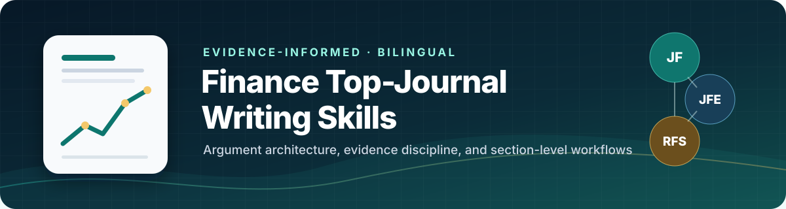

<p align="center">
  
</p>

<p align="center">
  <a href="README.md">English</a> · <strong>简体中文</strong>
</p>

<p align="center">
  <a href="https://github.com/yxyuan-joy/Finance-top-journal-writing-skills/releases/tag/v1.3.1"></a>
  <a href="https://github.com/yxyuan-joy/Finance-top-journal-writing-skills/actions/workflows/ci.yml"></a>
  
  
  <a href="LICENSE"></a>
</p>

# 金融三大顶刊写作 Skills

一套面向 *The Journal of Finance*（JF）、*Journal of Financial Economics*（JFE）和 *The Review of Financial Studies*（RFS）的 Agent Skills，用于起草、重构和审校金融论文。

它不是“顶刊句式库”，也不会机械模仿所谓期刊文风。项目把近年论文中可以复核的论证结构、章节功能和不同研究设计的可信度要求，转化成可复用的写作工作流。缺失事实会被明确标记；不会因为目标期刊更好就擅自强化结论。

> **独立、非官方项目。** 本项目未获得 American Finance Association、Elsevier、Oxford University Press、Society for Financial Studies 或三本期刊的认可或授权。

## 快速开始

### 让 Codex 安装

直接告诉 Codex：

```text
请用 $skill-installer 从 https://github.com/yxyuan-joy/Finance-top-journal-writing-skills 安装全部 skills。
```

### 在终端安装（macOS、Linux 或 WSL）

```bash
git clone https://github.com/yxyuan-joy/Finance-top-journal-writing-skills.git
cd Finance-top-journal-writing-skills
./scripts/install.sh
```

安装器会把 5 个 skills 复制到 `$HOME/.agents/skills`；如果已经显式设置 `CODEX_HOME`，则使用 `$CODEX_HOME/skills`。也可以只安装需要的部分：

```bash
./scripts/install.sh finance-top-journal-writing finance-causal-empirical-writing
```

安装器不会静默覆盖已有版本。使用 `--replace` 时会先在 skill 发现目录之外创建带时间戳的备份，再安装当前正式版；使用 `--target PATH` 可以指定其他 Agent Skills 目录。仓库同时包含 plugin manifest，兼容的 Codex plugin 分发流程可以把这 5 个 skills 作为一个整体安装。

Windows 原生环境建议使用上面的 `$skill-installer`，或把 `skills/` 下的 5 个文件夹复制到 `%USERPROFILE%\.agents\skills`。

## 如何选择 Skill

项目固定为 **5 个 skills**：一个全文核心，加上四种证据逻辑专项。这样可以减少触发冲突、重复规则和上下文浪费。

| Skill | 适用任务 |
|---|---|
| [`finance-top-journal-writing`](skills/finance-top-journal-writing/) | 任一章节或全文；标题、摘要、引言、文献、数据、设计、结果、稳健性、机制、结论、图表、附录和修回 |
| [`finance-asset-pricing-writing`](skills/finance-asset-pricing-writing/) | 预期收益、因子、SDF、异象、组合检验、可预测性、基金绩效和验证 |
| [`finance-causal-empirical-writing`](skills/finance-causal-empirical-writing/) | DID、事件研究、IV、RDD、自然实验、政策变化及其他识别导向设计 |
| [`finance-intermediation-markets-writing`](skills/finance-intermediation-markets-writing/) | 银行、非银中介、信贷供给、融资、流动性、交易商、价格发现、网络、监管和市场设计 |
| [`finance-theory-structural-writing`](skills/finance-theory-structural-writing/) | 纯理论、结构估计、定量模型、校准、反事实和福利分析 |

路由依据是“核心结论如何获得证据支持”，而不是宽泛的领域标签。治理自然实验属于因果实证；银行挤兑模型属于理论/结构；公司债券收益预测属于资产定价。只有当两种专项证据分别承担独立的核心论证时，才组合使用两个专项。

## 使用示例

```text
请用 $finance-top-journal-writing，根据下面的事实重构这篇 JF 论文的引言。
请用 $finance-asset-pricing-writing，检查这篇 RFS 摘要是否区分了发现样本、验证样本和可实施性。
请用 $finance-causal-empirical-writing，重写这篇 JFE 论文的识别与稳健性部分。
```

效果最好的输入至少包括：目标期刊、论文类型、研究问题、设计或模型、数据和样本、带单位的核心结果、证据边界、已经核实的最近文献，以及需要处理的章节。信息不完整时，skills 会使用明确占位符，不会用看似合理的内容补空白。

### 中英文输出

Skills 会遵循提示词中指定的输出语言。如果没有指定，就跟随用户的语言；对于变量名、引用键、公式和需要溯源的技术标签则保留原文。

```text
请用 $finance-top-journal-writing 重写摘要和引言，输出中文，不要补造数值或文献。
Use $finance-intermediation-markets-writing to audit this banking paper in English.
```

## 覆盖范围

- 标题与摘要；
- 引言、研究问题、缺口与贡献；
- 文献定位、理论、假设与制度背景；
- 数据、样本、变量构造、测量与研究设计；
- 结果、经济量级、稳健性、替代解释与机制；
- 异质性、讨论、局限与结论；
- 表格、图形、命题、在线附录与全文一致性；
- 编辑和审稿意见修回、回复信与正文同步。

四个专项会增加各自真正需要的检查。资产定价保留实时可得性、基准、成本与验证状态；因果实证把每项诊断对应到具体识别威胁；金融中介区分价格、数量、选择、替代与承担者；理论/结构区分识别、校准、拟合、反事实闭合与福利。

## 基于证据，而不是模仿

项目先对 **2020–2025 年 JF/JFE/RFS 的 2,065 篇普通研究论文**做结构普查，再为每个 skill 独立策展教学型证据集。

| 证据集 | 入选篇数 | 不属于总写作 50 篇的独立论文 |
|---|---:|---:|
| 总写作 | 50 | — |
| 资产定价 | 50 | 42 |
| 因果实证 | 60 | 49 |
| 金融中介与市场 | 60 | 46 |
| 理论与结构 | 50 | 40 |

五套证据共有 270 个入选席位，覆盖 224 篇唯一论文。标题和章节标题只用于高召回发现；正式入选必须直接检查摘要、完整引言、相关正文和结论。仓库只公开书目信息、聚合规律、原创归纳和合成示例，不公开本地 PDF、MinerU 文本或论文正文。

详细方法见已合并的 [`证据方法`](evidence/README.md)、[`Skill 架构对照`](evidence/architecture-benchmark.md) 和可审计的 [`证据集`](evidence/sets/)。

## 验证结果

当前规则经过确定性路由测试、合成 gold cases、隔离行为测试、held-out 迁移审计，以及另外三轮真实论文盲测。最新三轮使用 **15 篇此前从未进入证据集或测试集的论文**，JF/JFE/RFS 各 5 篇。写作者只看到独立释义的事实包，不知道论文身份，也不能看原文；输出冻结后才与原文做双向功能比较。

三轮均未出现 Major 或 Invalidating 缺陷，也没有重复问题被归因于 skill 指令缺失。最终确认组在完成局部输出修复后达到 3/3 Robust。这说明当前版本已经适合使用，但不意味着写作助手可以替代研究判断和来源核实。

请查看唯一的当前 [`验证报告`](evals/validation-report.md) 和可重跑的 [`评测说明`](evals/README.md)。

本地运行全部检查：

```bash
python3 scripts/validate_repo.py
python3 scripts/run_skill_evals.py
python3 -m unittest discover -s tests -v
```

## 仓库结构

```text
skills/      5 个可独立安装的正式 skills
evidence/    全量普查、策展集、来源与方法
evals/       版本化案例、合成 gold outputs、评分标准与最终报告
scripts/     安装器、仓库验证和评测工具
tests/       确定性回归测试
```

每个 skill 都采用渐进式加载：先由简短的 `SKILL.md` 路由任务，再只读取相关 reference 或可填写 asset。50/60 篇 evidence catalog 是可搜索的来源账本，不是每次任务都要加载的提示词。

## 不可妥协的安全门

1. 不编造数据、系数、样本、制度事实、引用、DOI、定理条件或期刊规则。
2. 相关性、预测、因果、结构参数和均衡反事实使用不同强度的表述。
3. 稳健性检验必须对应具体威胁，不能只是规格清单。
4. 不把异质性、中介、机制证据和排除替代解释混为一谈。
5. 每个数值都保留其规格、样本、单位、基准、不确定性和证据状态。
6. 不复制或近似模仿论文原文。
7. 涉及投稿格式或政策时，重新核对期刊实时官方说明。

## 许可与引用

原创代码和 skill 文本采用 [MIT License](LICENSE)。第三方论文、期刊名称和外部项目仍归各自权利人所有。

如果本项目对你的工作有帮助，请使用 [`CITATION.cff`](CITATION.cff) 中的元数据引用。

技能包遵循当前 [OpenAI Build skills](https://learn.chatgpt.com/docs/build-skills) 结构：`SKILL.md` 是入口，`agents/openai.yaml` 提供界面元数据，`references/`、`assets/` 和 `scripts/` 按任务加载。
